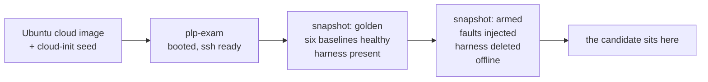

# Building the PLP examination environment

**One machine, one VM, one candidate.** Each computer in the lab runs this once
and hosts exactly one exam VM; the candidate sits at that computer.

```bash
./plp up            # ~15 min, unattended
```

That is the whole build. There is **no Ubuntu installer and no VM console** —
it uses the official Ubuntu cloud image with cloud-init, so nothing is ever
typed into a VM window. (Which is also why the VirtualBox-on-Wayland keyboard
problem never arises.)

---

## 1. What you are building

One VM, two snapshots.



`golden` is what you return to if you want to change a scenario. `armed` is the
state a candidate gets, and `./plp rearm` restores it between sittings.
Re-provisioning deletes `armed` along with the old `golden`, since it was armed
from the old baseline; run `./plp arm` afterwards.

A VM that still has `/opt/plp-exam` on it holds every answer. `./plp up`
verifies the harness is gone before it takes the `armed` snapshot, and refuses
to snapshot if it is not.

### Two audiences, one directory

| Audience | What they get | Produced by |
|---|---|---|
| **Examiner** (you) | Everything: `setup.sh`, `break.sh`, `verify.sh`, every `rubric.md`, all of `docs/`, this file | this repository, kept on **your** machine |
| **Candidate** | Six tickets, the instructions page, a FIXLOG template. Nothing else | `bin/make-candidate-bundle.sh`, installed onto the VM by `seal.sh` |

Build and inspect the candidate pack at any time:

```bash
bash bin/make-candidate-bundle.sh          # -> build/candidate-bundle/
```

It **fails closed**: an allowlist of filenames plus a grep for strings that only
occur in examiner material (`Faults injected`, `Viva follow-ups`, `verify.sh`,
`rubric`). If anything leaks it rejects the bundle and exits non-zero.

---

## 2. Requirements

A Linux host with VirtualBox. `./plp doctor` installs the rest (`qemu-utils`,
`xorriso`, `rsync`, `openssh-client`).

| | Needed |
|---|---|
| RAM | 4 GB for the VM, plus whatever the host wants |
| Disk | ~12 GB (cloud image + VM) |
| Network | internet **once**, during the build only |

The exam itself runs offline: `./plp up` finishes by moving the VM onto a
host-only network with no route out.

---

## 3. Build it

```bash
cd plp-examination
cp plp.conf.example plp.conf     # optional, but set CAND_PASSWORD
./plp up
```

Roughly fifteen minutes, unattended, ending with:

```
  Ready for the candidate.

  Sit the candidate at this machine and have them run:

      ssh candidate@192.168.56.10        password: plp2026
```

### What `up` does, stage by stage

| Stage | Command | What it does |
|---|---|---|
| `00-doctor` | `./plp doctor` | Checks the host, installs missing packages, generates a per-machine SSH key in `.plp/` |
| `10-image` | `./plp image` | Downloads the Ubuntu cloud image (~600 MB, cached), converts to VDI, resizes, builds the cloud-init seed with `xorriso` |
| `20-vm` | `./plp vm` | Creates the VM on NAT with an SSH forward, boots headless, waits for cloud-init and SSH |
| `30-provision` | `./plp provision` | Pushes the harness, runs `provision.sh`, pins the fixed exam address, sets the candidate password, **health-checks**, replaces every existing snapshot (`armed` too) with a fresh `golden` |
| `40-arm` | `./plp arm` | Injects the faults, installs the candidate bundle, deletes the harness, **verifies it is gone**, snapshots `armed`, then switches the VM to host-only and confirms it has no internet |

**Provisioning must end with `Baseline clean.`** That is the invariant: on an
unbroken box every automated check passes. If one FAILs there, the harness is
wrong, not your VM — fix that scenario's `setup.sh`, then `./plp provision`.
Arming a dirty baseline produces an unmarkable exam.

### Networking, and why it changes mid-build

| Stage | VM network | Why |
|---|---|---|
| Build | NAT + forward `127.0.0.1:2222` | needs internet for packages and the Python wheelhouse |
| Exam | host-only, fixed `192.168.56.10` | reachable from this host, **no internet** |

The fixed address comes from a small unit installed on the VM
(`/usr/local/sbin/plp-examnet`), so there is no DHCP to wait for and no address
to look up. The `s5` ticket tells the candidate the host has no internet — that
has to be true, and `./plp up` checks it.

### Configuration

| Setting | Default | Notes |
|---|---|---|
| `VM_NAME` | `plp-exam` | |
| `UBUNTU_RELEASE` | `24.04` | cloud image release |
| `DISK_MB` / `VM_RAM` / `VM_CPUS` | 25600 / 4096 / 2 | |
| `EXAM_IP` | `192.168.56.10` | where the candidate and `./plp score` reach the VM |
| `SSH_PORT` | 2222 | build-time only |
| `CAND_PASSWORD` | `plp2026` | **change this per sitting** — the default ships in the repo |
| `ADMIN_USER` | `examadmin` | your account on the VM: key-based, passwordless sudo |

`.plp/` holds the SSH key, the generated admin password, the downloaded image
and the seed ISO. It is git-ignored and machine-local.

---

## 4. Smoke-test before the candidate arrives

**Do not skip this.** A fault that failed to arm is invisible until a candidate
is sitting in front of it.

```bash
./plp status                    # built? running? reachable? harness removed?
ssh candidate@192.168.56.10     # password from plp.conf
```

Confirm every symptom:

| # | Command | Expected broken behaviour |
|---|---|---|
| 1 | `df -h /srv/data` and `df -i /srv/spool` | 100% used / 100% IUse |
| 1 | `touch /srv/spool/incoming/t` | No space left on device |
| 2 | `sudo -u bikram touch /srv/projects/statlab/shared/x` | Permission denied |
| 2 | `sudo -u anita sudo -n systemctl restart reportd` | refused |
| 3 | `getent hosts www.isi.local` | nothing, after a pause |
| 3 | `getent hosts portal.isi.local` | answers `192.0.2.77` — wrong |

And that the candidate's view is complete, and nothing else is:

```bash
ls ~/tickets          # three tickets + 00-READ-ME-FIRST.md
head -5 ~/FIXLOG.md   # the template
ls /opt/plp-exam      # must be: No such file or directory
```

All of those are read-only, so the VM stays pristine. If you want certainty
anyway, `./plp rearm` puts it back.

---

## 5. On the day

**Before the candidate enters**

- [ ] `./plp status` — running, reachable, harness `removed`
- [ ] Smoke test passed
- [ ] `CAND_PASSWORD` set for this sitting and written on the board
- [ ] Screen recording running on the host desktop
- [ ] If handing out paper: `build/candidate-bundle/ALL-TICKETS.md` printed

**How the candidate works**

They open a terminal on the host and run:

```bash
ssh candidate@192.168.56.10
```

Everything they do happens inside the VM, so nothing they type can damage the
lab machine. Screen-record the host desktop; the VM also keeps its own command
transcript at `/var/log/exam-audit.log`.

> They *can* instead use the VirtualBox console window, but on a Wayland desktop
> the console keyboard is unreliable. SSH avoids it entirely.

Rebuilding the VM changes its host key, so `ssh` will refuse to connect until
the old one is cleared. Put this in the lab machine's `~/.ssh/config` once and
it stops being a problem — the exam VM is a disposable box on a private network,
so pinning its key buys nothing:

```
Host 192.168.56.10 127.0.0.1
  StrictHostKeyChecking no
  UserKnownHostsFile /dev/null
  LogLevel ERROR
```

**At the start of Part B**

Read the Constraints rule aloud: they are marked, and breaking one loses marks
even when the symptom goes away. Point out that every ticket ends with the exact
commands to check their own work.

**If a scenario gets wedged beyond recovery**

```bash
./plp reset s2-disk
```

Rebuilds and re-arms only that scenario, on this VM, and removes the harness
again afterwards. Note it on their sheet: it costs them time, not marks.

---

## 6. Scoring

Score **while the VM is still running** and the candidate is logged out. The
disk and VPN checks read live state, and a logged-in shell can hold files open.

```bash
./plp score
```

Writes into `marks/`, timestamped:

| File | Contents |
|---|---|
| `marks/<stamp>.txt` | per-check PASS / FAIL / PENALTY and the Part B total |
| `marks/<stamp>-fixlog.md` | the candidate's FIXLOG |
| `marks/<stamp>-audit.log` | their command transcript |

Two timing caveats the checks impose: `s2.reportd` wants the log written in the
last 40 seconds, and `s6.handshake` a handshake in the last 180 seconds. Score
soon after the sitting, and do not stop services first.

Then add the FIXLOG and viva marks by hand — [docs/scoring-sheet.md](docs/scoring-sheet.md).

---

## 7. The next candidate on the same machine

```bash
./plp score          # first — this is destructive afterwards
./plp rearm          # restores the pristine 'armed' snapshot, boots it
```

`rearm` asks for confirmation, because it discards everything the previous
candidate did. Change `CAND_PASSWORD` between sittings and re-run `./plp arm`
if you want a different password; otherwise `rearm` alone is enough.

---

## 8. Teardown

```bash
./plp destroy        # removes the VM and its snapshots; .plp/ downloads are kept
```

Keep the VM until the appointment is made — you may need to re-score or show the
panel a scenario.

---

## 9. Giving this to a colleague

They need a Linux host with VirtualBox and this repository. Nothing else.

```bash
cp plp.conf.example plp.conf     # set CAND_PASSWORD at minimum
./plp up
```

`./plp doctor` installs whatever host packages are missing and generates a
**separate** SSH key under their own `.plp/`. Their VM is independent of yours;
nothing is shared between machines, so every lab computer can be prepared in
parallel by whoever sits at it.

Do not send them `.plp/` or `marks/` — the first holds a private key, the second
holds candidates' work. Both are git-ignored.

---

## 10. The manual route

Only if you cannot use the cloud image — an air-gapped host, or a site policy
requiring an installed-from-ISO system.

1. Create a VM with 2 vCPU / 4 GB / 25 GB disk on NAT, attach the
   **Ubuntu Server 24.04** ISO (not Desktop, not "minimized" — see below).
2. Install it, **ticking "Install OpenSSH server"**.
3. Forward a host port:
   `VBoxManage modifyvm <vm> --natpf1 "ssh,tcp,127.0.0.1,2222,,22"`
4. Copy the repo in and provision, with the VM still on NAT:
   ```bash
   scp -P 2222 -r plp-examination USER@127.0.0.1:~/
   ssh -p 2222 USER@127.0.0.1 \
     'sudo cp -a ~/plp-examination /opt/plp-exam &&
      sudo bash /opt/plp-exam/vm/provision.sh --i-know-this-is-a-disposable-vm'
   ```
   It must end with `Baseline clean.`
5. Power off, snapshot `golden`.
6. Boot, then arm and seal:
   ```bash
   ssh -p 2222 USER@127.0.0.1 'sudo bash /opt/plp-exam/bin/exam-ctl.sh arm'
   ssh -t -p 2222 USER@127.0.0.1 'sudo bash /opt/plp-exam/bin/seal.sh'   # answer: yes
   ```
7. Power off, snapshot `armed`, switch the NIC to host-only, boot. Continue
   from §4.

**Not Desktop:** it runs NetworkManager, which rewrites `/etc/resolv.conf` and
interferes with the DNS scenario, and costs RAM for a GUI nobody uses. The
harness defends against NetworkManager if it finds it, but Server is the tested
path.

**Not "minimized":** that image excludes man pages, and the exam VM is offline —
`man` is the candidate's only reference. `provision.sh` refuses to run on a
minimized image; add `--unminimize` if you are stuck with one.

---

## Troubleshooting

| Symptom | Cause and fix |
|---|---|
| `./plp up` stops at `10-image` | No internet, or a truncated download. `rm .plp/*.img` and re-run `./plp image`. |
| `qemu-img convert failed` | `qemu-utils` missing, or the image is corrupt. Same fix. |
| VM never answers SSH in `20-vm` | Watch it boot: `VBoxManage startvm plp-exam --type gui`. Usually cloud-init failing on a bad seed — `rm -rf .plp/seed* && ./plp image`. |
| Provisioning ends without `Baseline clean.` | A scenario's `setup.sh` is wrong for your OS version. The FAIL line names it; fix, then `./plp provision`. |
| `provision.sh` refuses: *marker missing* | Guard so these destructive scripts can never run on a real machine. Only `--i-know-this-is-a-disposable-vm` creates the marker. |
| `the VM did not take 192.168.56.10` | Check `/usr/local/sbin/plp-examnet` on the VM; the interface match is `^(en\|eth)`. |
| `could not create a host-only interface` | Rare; needs `sudo VBoxManage hostonlyif create` once. |
| `./plp status` says harness **PRESENT** | The VM has the answers on it. Do not hand it out — re-run `./plp arm`. |
| A verify FAILs on something the candidate clearly fixed | Check they are logged out, and score promptly — see the timing caveats in §6. |
| `REMOTE HOST IDENTIFICATION HAS CHANGED` | Expected. Rebuilding or `rearm`ing gives the VM a new host key. `ssh-keygen -R '[127.0.0.1]:2222'` and `ssh-keygen -R 192.168.56.10`, or use the `~/.ssh/config` block below. |
| `Permission denied` as `candidate` on 127.0.0.1 | You omitted `-p 2222` and hit your **own** machine's sshd. During the exam the VM is at `192.168.56.10:22` and no port is needed. |
| VirtualBox GUI keyboard dead (Wayland host) | Irrelevant here — this tool never opens a console. If you need one: `QT_QPA_PLATFORM=xcb VirtualBox`. |

---

## Quick reference

```bash
./plp up                     # build everything
./plp status                 # built? running? reachable? sealed?
./plp reset s2-disk          # rebuild one scenario mid-exam
./plp score                  # -> marks/
./plp rearm                  # pristine again, for the next candidate
./plp destroy

./plp doctor|image|vm|provision|arm      # one stage at a time
bash bin/make-candidate-bundle.sh        # -> build/candidate-bundle/

# on the VM itself
sudo bash /opt/plp-exam/vm/healthcheck.sh          # "Baseline clean."
sudo bash /opt/plp-exam/bin/exam-ctl.sh arm s4-dns
sudo bash /opt/plp-exam/bin/score.sh s3-permissions
```
